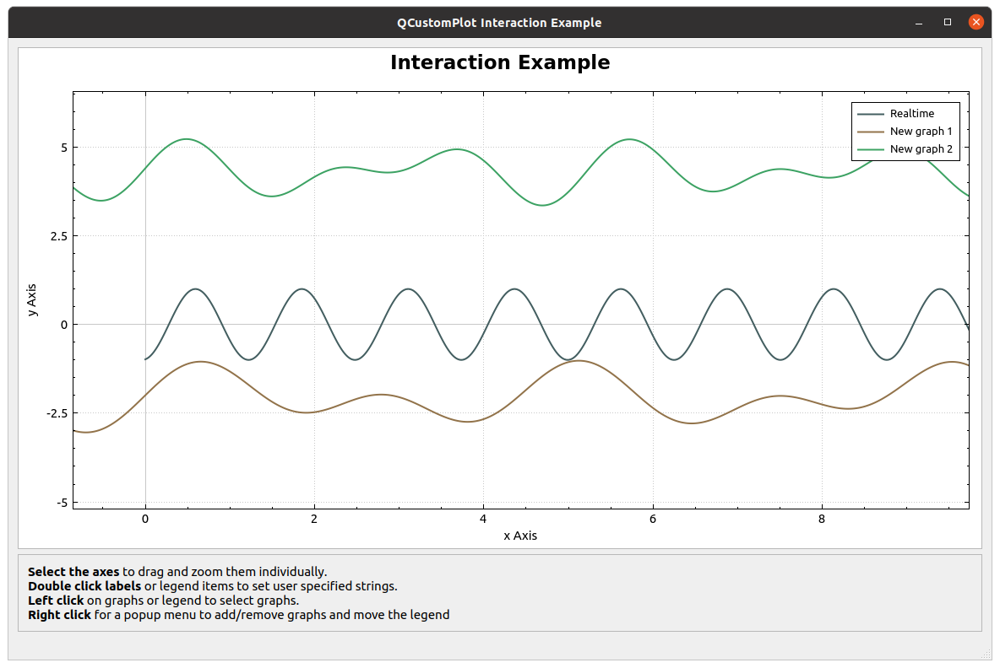

# QCustomPlot Demo with realtime animation



Plots two random waves and one "realtime" wave by adding samples
continuously at at t=0.

## Required packages

Install the QT5 development packages:

```
apt-get install qtdeclarative5-dev-tools
apt-get install libqcustomplot-dev
```

## Build it

```
cmake .
make
```

## Run it

```
./qcustomplotdemo
```

## Credit

Based on the "interactive" example from Qcustomplot:

https://www.qcustomplot.com/
